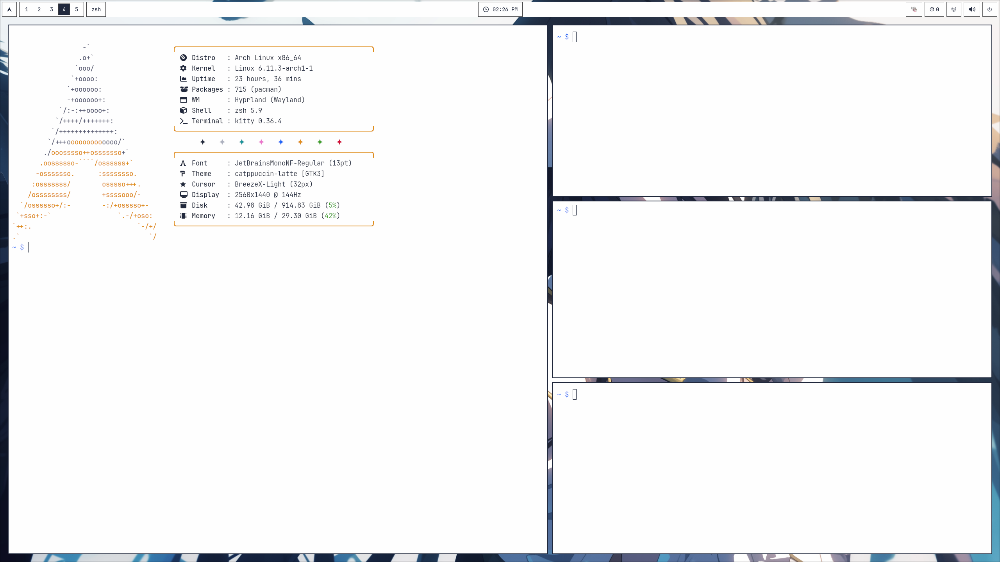

## Disclaimer
These are my personal dotfiles, so expect to tinker with them, especially with monitor configurations in ``hypr/hyprland.conf`` and theming, as they won't work out of the box.

All information regarding keybinds, programs, etc. Is located inside of ``hypr/hyprland.conf``, and ``install.sh``.

## Usage
Install via curl
  ```shell
  curl -fsSL https://github.com/nnyyxxxx/dotfiles/raw/main/scripts/install.sh | sh
  ```

## Preview

